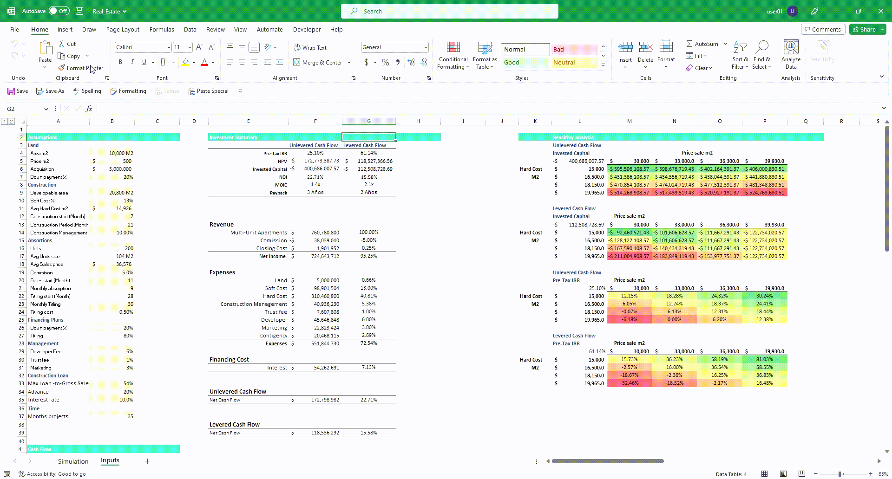

# Real Estate Excel (Python Montecarlo)

To gain deeper insights of your real estate investments.

I built my real estate model on Excel, which included assumptions and inputs for things like  income, operating expenses, property value appreciation, and other key variables. This model served as the foundation for my Monte Carlo simulation.

Next, I used Python code on Jupyter-Lab to create a script that generated a series of random values for each of these variables based on their probability distributions. These random values were used as inputs for each iteration of the Monte Carlo simulation.

By combining the power of Excel, Python, and Jupyter-Lab, a robust real estate model that provides valuable insights into the potential outcomes of your investments. The Monte Carlo simulation allows you to explore a wide range of scenarios and probabilities, giving you a more complete picture of the risks and opportunities involved in your investment.